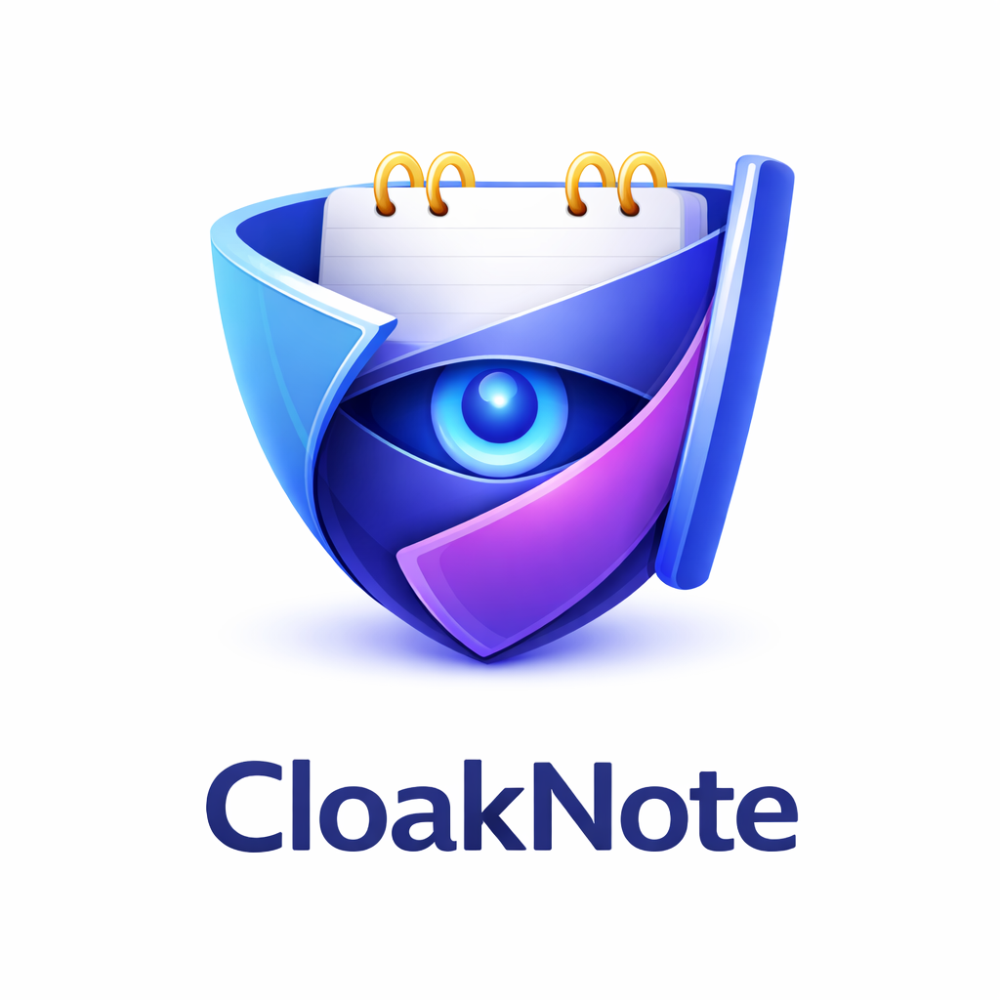

# CloakNote - Encrypted macOS Notes App with Private GitHub Sync

<p align="center">
  
</p>

https://github.com/user-attachments/assets/7cf03b32-8710-4f6e-91f3-f0cf2253f5a3

[Turkish](README.tr.md)

CloakNote is an encrypted macOS notes app with private GitHub sync.

Your notes stay in your own private GitHub repository, encrypted before upload and decrypted locally on your Mac.

[Download](#download) · [Features](#features) · [How It Works](#how-it-works) · [Build](#run-locally)

## Download

Download the latest `.dmg` from [the latest release](https://github.com/sarisen/CloakNote/releases/latest).

Or install with Homebrew:

```bash
brew install sarisen/cloaknote/cloaknote
```

1. Download `CloakNote-<version>.dmg`
2. Open the DMG and drag CloakNote to `Applications`
3. If macOS blocks the first launch, run:

```bash
xattr -c /Applications/CloakNote.app
```

Then right-click the app and choose `Open`.

## Features

- End-to-end encrypted notes with a local passphrase
- Private GitHub repository sync in your own account
- Turkish and English UI
- Auto-lock, theme, and note statistics

## How It Works

1. You unlock CloakNote with your passphrase.
2. The app derives an encryption key locally on your Mac.
3. Each note is encrypted before it is uploaded.
4. Only encrypted files are stored in your private GitHub repository.
5. When you open your notes, CloakNote fetches the encrypted files and decrypts them locally with your passphrase.

Your readable note content never needs to live in GitHub as plain text.

## Security & Privacy

- Your notes are stored in your own private GitHub repository
- CloakNote uploads encrypted note files, not readable plain text
- Your passphrase and derived key stay local to your Mac
- Without your passphrase, the repository contents are not readable
- If someone accesses the repository without the key, they only see encrypted data

## First Setup

1. Launch the app.
2. Choose your language in onboarding.
3. Set a strong passphrase.
4. Create a GitHub Personal Access Token with `repo` scope.
5. Enter your repository details, or let CloakNote create the private repository for you.

## Project Structure

```text
CloakNote/
├── CloakNote.xcodeproj
├── CloakNote/
│   ├── CloakNoteApp.swift
│   ├── Models/
│   ├── Services/
│   ├── Utilities/
│   ├── ViewModels/
│   ├── Views/
│   └── Assets.xcassets/
├── docs/
├── scripts/
├── .github/workflows/
└── README.md
```

### Main folders

- `Models`: note and encryption payload models
- `Services`: crypto, GitHub sync, and keychain access
- `Utilities`: constants, extensions, and localization support
- `ViewModels`: app state and settings logic
- `Views`: SwiftUI screens such as onboarding, lock screen, editor, and settings
- `docs`: README assets such as screenshots and demo files
- `scripts`: local build and packaging helpers
- `.github/workflows`: GitHub Actions automation for releases

## Requirements

- macOS 14 or newer
- Xcode 16 or newer
- A GitHub account
- A GitHub Personal Access Token with `repo` scope

## Run Locally

```bash
git clone https://github.com/sarisen/CloakNote.git
cd CloakNote
open CloakNote.xcodeproj
```

Or build from terminal:

```bash
xcodebuild -project CloakNote.xcodeproj -scheme CloakNote -configuration Debug build
```

Automatic DMG releases are created from version tags.

## License

MIT.
